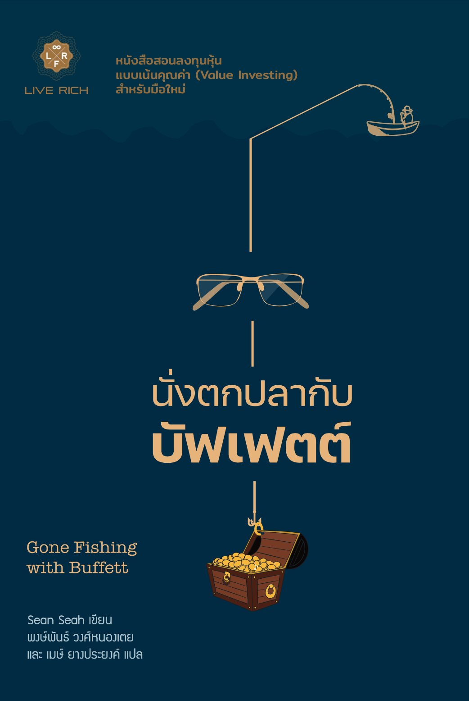

หนังสือเล่มนี้เป็นหนังสือที่สอนการลงทุนแบบเน้นคุณค่า โดยนำคำแนะนำของบัฟเฟตต์ มาแต่งเป็นเรื่องเล่าของนักตกปลากับชายหนุ่มผู้บาดเจ็บจากตลาดหุ้น เพราะคนเรามักจะจดจำและเข้าใจเรื่องเล่าได้ดีกว่า

ดังนั้นไม่มีอะไรใหม่ แต่สำหรับนักลงทุนมือใหม่ที่พึ่งเริ่มหรือกำลังจะลงทุนในตลาดหุ้น แต่ไม่รู้ว่าจะเริ่มอ่านหนังสือเล่มไหนก่อนดี เพราะหนังสือสอนการลงทุนในท้องตลาดตอนนี้มีอยู่เยอะมาก หนังสือเล่มนี้จะช่วยได้ครึ่งหนึ่ง ส่วนอีกครึ่งหนึ่งต้องลงมือนำความรู้ไปใช้และเรียนรู้มันด้วยตนเอง

สรุปแล้วมือใหม่ควรไปหามาอ่านก่อนจะเริ่มลงทุน ส่วนผู้เชี่ยวชาญจะใช้หนังสือเล่มนี้เป็นการทบทวนและตรวจสอบความเข้าใจที่มีอยู่ก็ได้

ปล. [ตัวอย่างเนื้อหาในหนังสือ](https://liverich.co.th/products/finance-business/gone-fishing-with-buffett/)
