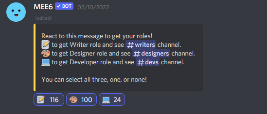
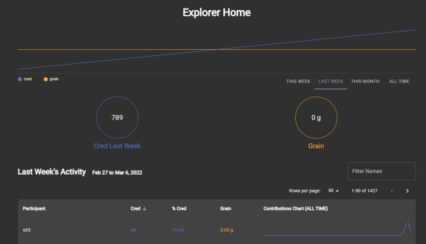

# วิธีการทำงานบนโอเวอร์เลย์

บทความนี้เป็นข้อมูลเบื้องต้นสำหรับผู้ที่สนใจทำงานให้กับโอเวอร์เลย์โปรโตคอล โดยก่อนจะเริ่มไปทำงานเรามารู้จักกันคร่าวๆ ก่อนว่าโอเวอร์เลย์โปรโตคอลคืออะไร

โอเวอร์เลย์คือโปรโตคอลสำหรับการเทรดข้อมูลต่างๆ บนโลก DeFi ไม่ว่าจะเป็นราคาเหรียญ หรือราคา NFTs โดยเราสามารถทำได้ทั้ง short และ long โดยไม่ต้องมีคนมาทำสัญญากับเรา ไม่ต้องมี liquidity pool สำหรับข้อมูลที่เราต้องการเทรด แต่ใช้การล็อคเหรียญ OVL ซึ่งเป็นเหรียญของโอเวอร์เลย์แทน ทำให้สามารถเทรดข้อมูลทุกอย่างที่อยู่บนโลก DeFi โดยคุณสามารถอ่านเรื่องนี้เพิ่มเติมได้ที่ [Introducing Overlay](https://medium.com/@england.eng29/introducing-overlay-thai-version-1be8e22b44d0) และ [White paper](https://planckcat.mypinata.cloud/ipfs/QmVYywKyNuZNDZdWFRzD8ehEd3oVkKsDTEJuoRL85DSDrj)

# วิธีการทำงาน

ตอนนี้โอเวอร์เลย์ยังอยู่ในช่วงเริ่มต้น ยังต้องการผู้มาร่วมทำงานอีกเป็นจำนวนมาก ไม่ว่าจะเป็นงานเขียน งานแปล งานออกแบบ หรืองานเขียนโปรแกรม โดยผู้ที่สนใจทำงานให้เริ่มจาก

1. เข้าไปที่โอเวอร์เลย์ ดิสคอร์ด https://discord.gg/FgNhRNtQYv

2. เข้าไปที่ห้อง [✋│looking-to-contribute](https://discord.com/channels/798007956239024148/798014473473490944) เพื่อขอสมัครเป็น overlay contributors โดยแนะนำตัวตามเทมเพลทนี้

> **Name:** ชื่อจริงหรือชื่อเล่นหรือชื่อที่อยากให้เรียก
> **Experience:** ประสบการณ์การทำงาน สามารถใส่ได้หมดทั้งงานในโลกจริงและงานบนโลก DeFi
> **Want to work:** แผนกที่ต้องการทำ (Backend/Frontend/Business/Operatons/Emissions/Project Management etc)
> **Specific Skills:** ความสามารถเฉพาะทาง (Java, JS, HTML, CSS, Python, Solidity, Scheme, Prolog, C/C++, Dune Analytics, The Graph, etc)
> **Bandwidth:** เวลาที่สามารถทำงานให้กับโอเวอร์เลย์ได้ เป็นชั่วโมงต่อสัปดาห์หรือต่อเดือน

เมื่อทีมสนใจจะทักเพื่อพูดคุยและให้ role Overlay Contributors กับเรา แต่ถ้าทีมยังไม่ทัก หรือเราไม่สะดวกที่จะเขียนโปรไฟล์ เราสามารถเข้าไปที่ [โพสต์นี้](https://discord.com/channels/798007956239024148/798007956239024152/941115101082161222) ในห้อง [✨│faq│start-here](https://discord.com/channels/798007956239024148/798007956239024152) เพื่อกดรับ role ที่ต้องการซึ่งตอนนี้มี 3 role คือ #writers สำหรับงานเขียน #designers สำหรับงานออกแบบ และ #devs สำหรับงานเขียนโปรแกรม การได้ role เหล่านี้จะทำให้เราสามารถเข้าไปพูดคุยในห้องรับงานแต่ละประเภทได้

3. ถึงขั้นนี้เราก็พร้อมที่จะทำงานได้แล้ว โดยผมขอแบ่งงานเป็น 2 ประเภทใหญ่ๆ คือ bounties กับ งานทั่วไป

**งาน bounties** คืองานที่ทีมประกาศหาคนทำ ซึ่งมักจะเป็นงานสำคัญ หรืองานที่จำเป็นต้องทำก่อนจะเริ่มทำงานบางอย่าง โดยแบ่งเป็น 3 ประเภทตาม role ที่เราไปกดรับกันมานี่เอง เราสามารถไปเช็คประกาศใน Notion board ได้ว่าตอนนี้มีอะไรให้ทำบ้าง ถ้าเจองานที่สนใจ ให้ไปขอทำงานที่ห้องรับงานนั้นๆ และเริ่มงานเมื่อทีมอนุมัติ โดยสามารถดูวิธีรับงาน bounty แบบละเอียดได้ที่ [Overlay Cred Challenge (Thai translation)](https://rachanont.notion.site/Overlay-Cred-Challenge-Thai-translation-7eebc62dae95466182a5dacce9ae03e4)

**งานทั่วไป** คืองานที่เราสามารถทำได้โดยไม่ต้องขอทีมก่อน ดังนี้

- เขียนโค้ดให้กับโปรโตคอล โดยเข้าไปดูโค้ดได้ที่ https://github.com/overlay-market/v1-core เมื่อทีมยอมรับโค้ดเข้า main repo ก็จะได้คะแนน
- เขียนคู่มือหรือวิธีการใช้งาน เมื่อทำเสร็จแล้วให้มาส่งลิ้งค์งานในห้อง [#writers](https://discord.com/channels/798007956239024148/941077780639146014) เพื่อขอเคลมคะแนน
- เข้ามาช่วยตอบคำถาม หรือให้ความช่วยเหลือสมาชิกในดิสคอร์ด ถ้าทีมถูกใจจะให้คะแนนสำหรับการช่วยงาน
- ช่วยทีมพัฒนาโปรโตคอลโดยการถามคำถาม หรือให้คำแนะนำในดิสคอร์ด โดยเน้นใน 3 เรื่องหลักคือ เฟรมเวิร์คความเสี่ยง (risk framework) คุณค่าของ DAO และ กลยุทธ์/เป้าหมายระยะยาวของโปรโตคอล
- โพสทวิตเตอร์ให้ข้อมูลเกี่ยวกับโอเวอร์เลย์ โดย tag [@OverlayProtocol](https://twitter.com/OverlayProtocol) และเอาลิ้งค์มาโพสในห้อง [😜│memes-and-tweets](https://discord.com/channels/798007956239024148/842081147110424586) เพื่อรับคะแนน ยิ่งโพสน่าสนใจ และมีอิมแพค ยิ่งได้คะแนนเยอะ
- ทำมีม หรืองานอาร์ท โพสลงทวิตเตอร์ แล้ว tag [@OverlayProtocol](https://twitter.com/OverlayProtocol) และเอาลิ้งค์มาโพสในห้อง [😜│memes-and-tweets](https://discord.com/channels/798007956239024148/842081147110424586) เพื่อรับคะแนน ยิ่งมีคนชอบเยอะ ยิ่งได้คะแนนเยอะ

# คะแนน และ PCD

เมื่อมีการทำงานแล้วก็ต้องมีการตอบแทน ทางทีมโอเวอร์เลย์ใช้ระบบ SourceCred ซึ่งเป็นระบบการให้คะแนนในการทำงานแบบหนึ่ง ซึ่งผมจะเรียกสั้นๆ ว่าคะแนน โดยระบบนี้จะมีทั้งการให้คะแนนอัตโนมัติโดยบ็อท และให้คะแนนโดยทีมและคนที่มี role พิเศษ (ดูคะแนนของแต่ละงานได้ที่ Overlay SourceCred [[En](https://docs.google.com/spreadsheets/d/1xqmGacIOdIkQhBH6wHvA8NpAipB1Rl-twBjbrUCa1JQ/edit#gid=1086331086) | [Th](https://docs.google.com/spreadsheets/d/1FDOOJrRiL4iS5xuilrh0YqwsOOWqPYhsENkFVA9S7Ug/edit?usp=sharing)])

เมื่อเราเริ่มทำงานก็จะได้คะแนนนี้มาสะสมไว้ (ดูคะแนนของคุณได้ที่ [SourceCred](https://overlay-market.github.io/overlay-sourcecred/#/explorer) โดยค้นจากชื่อในดิสคอร์ด) โดยเป้าหมายแรกของทุกคนคือ 1,000 คะแนน เพื่อนำไปแลก PlanckCat DAO NFTs หรือ PCD ซึ่ง PCD นี้คือคีย์สำคัญในการกำกับดูแลโอเวอร์เลย์ในอนาคต และอาจใช้เป็นส่วนลดค่าธรรมเนียมในการใช้งานโปรโตคอลเมื่อโอเวอร์เลย์เปิดใช้งานบนเมนเน็ท ดังนั้นทุกคนไม่ควรพลาดที่จะเป็นเจ้าของ PCD

📖อ่านเรื่อง PCD เพิ่มเติมได้ที่ [PlanckCat DAO (Thai translation)](https://rachanont.notion.site/PlanckCat-DAO-Thai-translation-db6004b07e454b26a2fb5ce62f6ba47a)

ถึงตรงนี้คิดว่าทุกคนคงเข้าใจวิธีการทำงานแล้ว ขอให้ทุกคนสนุกกับการทำงานบนโอเวอร์เลย์ครับ

Website: https://overlay.market/
Twitter: https://twitter.com/OverlayProtocol
Telegram: https://t.me/joinchat/Vh4ghHUTZI53z5OH
Discord: https://discord.gg/FgNhRNtQYv
Github: https://github.com/overlay-market
Overlay Thai Resource: https://rachanont.notion.site/Overlay-324a8d3d2b4c4bd6920ccc785f2c9149