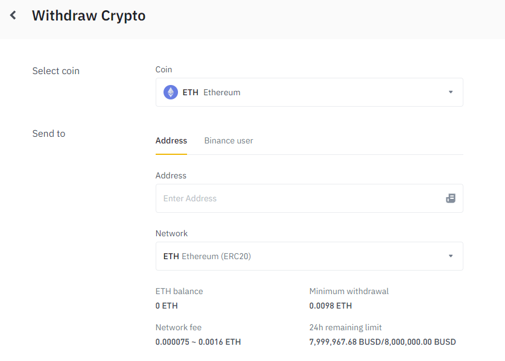
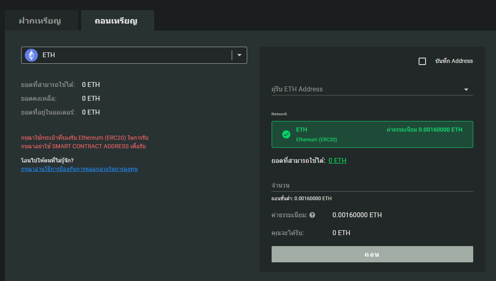
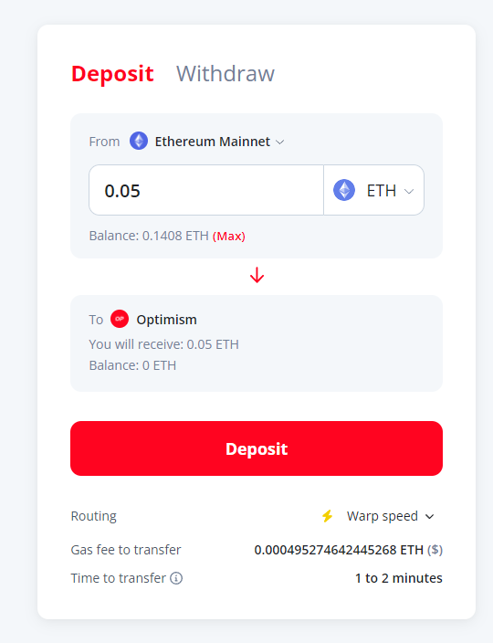
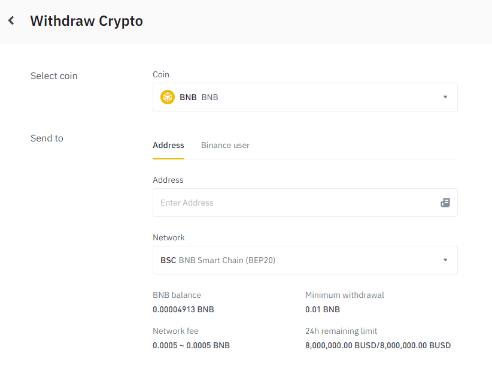
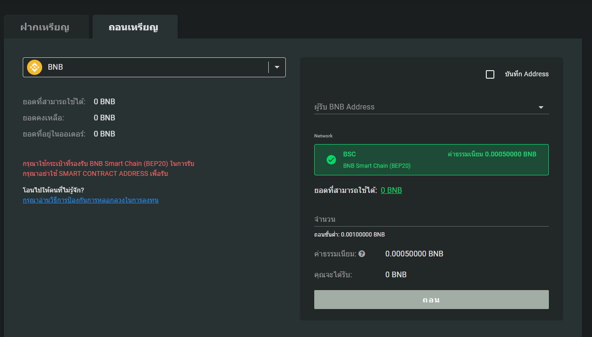
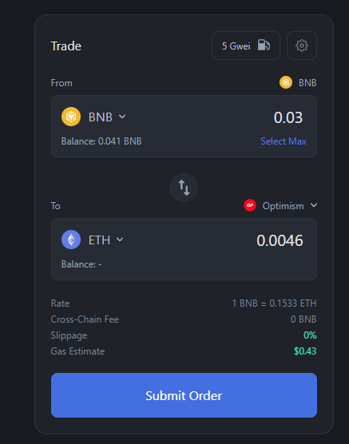
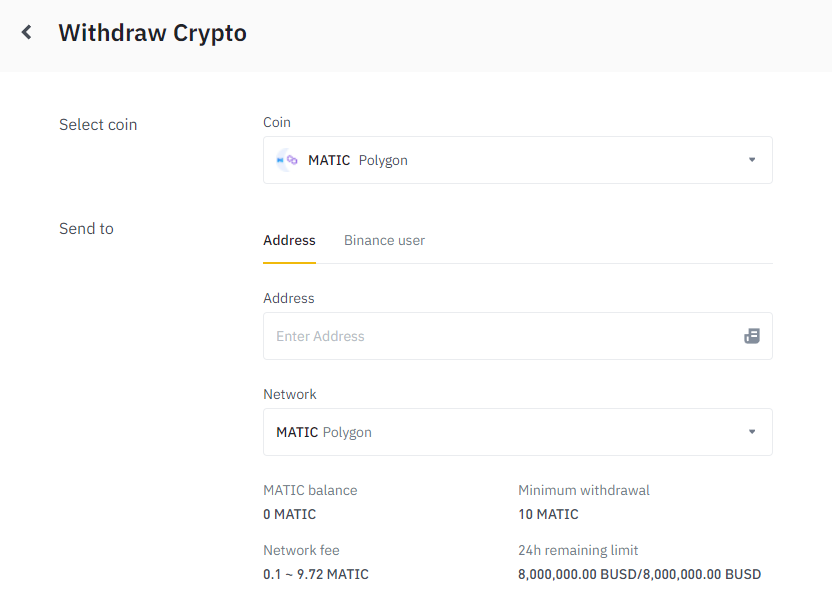
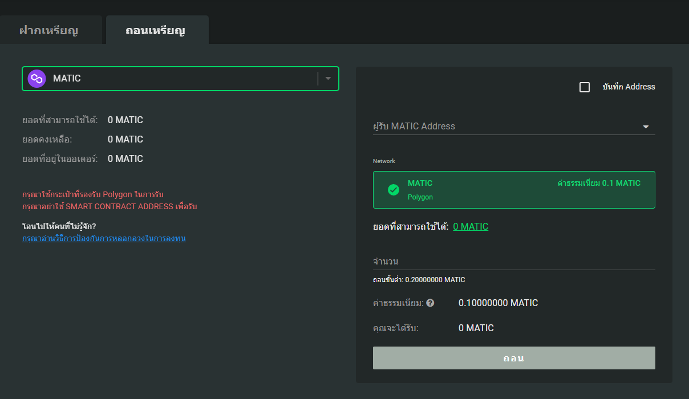
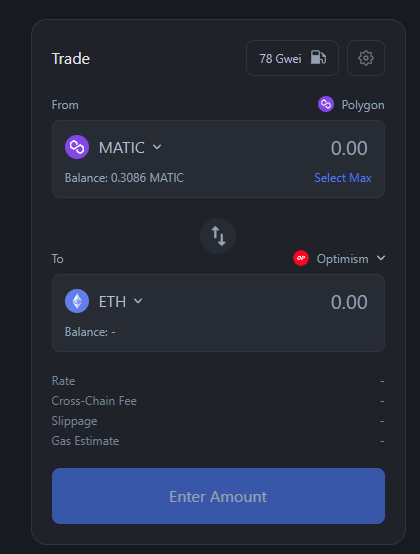

## วิธีการโอนเหรียญ ETH เข้าเชน Optimism

### สิ่งที่ต้องมี

- บัญชี crypto exchange ไทยหรือต่างประเทศอย่างน้อย 1 บัญชี สำหรับซื้อเหรียญ ETH
  - วิธีเปิดบัญชี [bitkub](https://youtu.be/8Mi8-AIVVQc) | [satang pro](https://youtu.be/HhMP3MsbdH8) | [Binance](https://youtu.be/C9jVEepj5NU) | [FTX](https://youtu.be/dlA0yXutp50)
- กระเป๋าเงินบน Ethereum/Optimism ซึ่งสร้างแค่กระเป๋าเดียวจะใช้ได้ทั้งสองเชนเพราะสองเชนนี้ใช้ Seed Phrase / Private Key อันเดียวกันในการสร้างกระเป๋า
  - [วิธีเปิดบัญชี กระเป๋า METAMASK](https://www.youtube.com/watch?v=ck_u6CcMhY8)

### วิธีที่ 1 โอนจากเชน ETH ไป Optimism

วิธีนี้จะเสียค่าธรรมเนียมเยอะสุดประมาณ 200 - 300 บาท เหมาะสำหรับผู้ที่อยากลุ้น airdrop จาก Optimism

1. ซื้อเหรียญ ETH จาก crypto exchange จำนวนที่ต้องการ
2. ถอนเหรียญเข้ากระเป๋าเงินบน Ethereum โดยเลือกเชนที่ถอนเข้าเป็น ETH (ERC20)

หน้าจอถอนเหรียญของ Binance ให้ใส่เลขกระเป่าในช่อง Address

หน้าจอถอนเหรียญของ Bitkub ให้ใส่เลขกระเป่าในช่อง ผู้รับ

3. เมื่อเหรียญเข้ามาในกระเป๋าเรียบร้อยแล้ว ให้ไปยังเว็บไซต์สำหรับบริดจ์เหรียญไปยังเชน Optimism ซึ่งสามารถเลือกได้จาก[หน้ารวมลิ้งค์ของ Optimism](https://www.optimism.io/apps/bridges) แต่ในที่นี้จะเลือกใช้เป็น [official bridge ของ Optimism](https://app.optimism.io/bridge)

[Explore the Optimism CollectiveLearn about OP and get started using applications on Optimism.app.optimism.io](https://app.optimism.io/bridge)

4. เชื่อมต่อกระเป๋ากับเว็บไซต์และตรวจสอบว่าเลือกเชนใน metamask เป็น Ethereum mainnet จากนั้นใส่จำนวนเหรียญที่ต้องการโอน แล้วเลือก Deposit จะมีหน้าต่างของ metamask ให้เรากดยืนยัน ให้ทำการยืนยันให้เรียบร้อย (ต้องเผื่อ ETH ไว้สำหรับจ่ายค่าธรรมเนียมในขั้นตอนนี้ประมาณ 2 - 6 usd)

หน้าจอโอนเหรียญไปยัง เชน Optimism

5. เพิ่มเชน Optimism ใน Metamask โดยใส่ข้อมูลตามนี้ ([คลิปอธิบายวิธีเริ่มต้นใช้งาน Optimism](https://youtu.be/qpeKB9iFMyE))

 **Chain Name:** Optimism
**Chain ID:** 10
**RPC Url:** https://mainnet.optimism.io/
**Symbol:** OETH
**Block Explorer Url:** https://optimistic.etherscan.io/

6. จากนั้นรอประมาณ 1 - 2 นาทีเหรียญจะเข้ามายังกระเป๋าของเราในเชน Optimism ถ้ายังไม่ขึ้นอาจเช็คจากเว็บไซต์ https://optimistic.etherscan.io/ โดยใส่เลขกระเป๋าของเราลงไปแล้วค้นหา

เท่านี้คุณก็จะมีเหรียญ ETH พร้อมสำหรับใช้ทำธุรกรรมใน เชน Optimism ไม่ว่าจะเป็นซื้อขายเหรียญ หรือมิ้นท์ NFTs แล้ว

### วิธีที่ 2 โอนจากเชน BSC ไป Optimism

วิธีนี้จะประหยัดกว่าวิธีแรกมาก เหมาะสำหรับผู้ที่ไม่ต้องการลุ้น airdrop จาก Optimism

1. ซื้อเหรียญ BNB จาก crypto exchange จำนวนที่ต้องการ
2. ถอนเหรียญเข้ากระเป๋าเงินบนเชน BSC โดยเลือกเชนที่ถอนเข้าเป็น BSC (BEP20)

หน้าจอถอนเหรียญของ Binance ให้ใส่เลขกระเป่าในช่อง Address

หน้าจอถอนเหรียญของ Bitkub ให้ใส่เลขกระเป่าในช่อง ผู้รับ

3. ไปยังเว็บไซต์สำหรับโอนเหรียญข้ามเชนเช่น [cBridge](https://cbridge.celer.network/#/transfer) [Connext](https://bridge.connext.network/) หรือ [Hashflow](https://app.hashflow.com/) ซึ่งในที่นี้ผมจะใช้ [Hashflow](https://app.hashflow.com/)

4. เชื่อมต่อกระเป๋ากับเว็บไซต์และตรวจสอบว่าเลือกเชนใน metamask เป็น BNB จากนั้นใส่จำนวนเหรียญที่ต้องการโอน แล้วเลือกเหรียญและเชนปลายทางตามรูป แล้วเลือก Submit Order จะมีหน้าต่างของ metamask ให้เรากดยืนยัน ให้ทำการยืนยันให้เรียบร้อย (ต้องเผื่อ BNB ไว้สำหรับจ่ายค่าธรรมเนียมในขั้นตอนนี้ประมาณ 0.5 usd)

หน้าจอโอนเหรียญไปยัง เชน Optimism ผ่าน Hashflow

5. เพิ่มเชน optimism ใน metamask (ดูวิธีได้จากด้านบน) จากนั้นรอประมาณ 5 นาทีเหรียญจะเข้ามายังกระเป๋าของเราในเชน Optimism ถ้ายังไม่ขึ้นอาจเช็คจากเว็บไซต์ https://optimistic.etherscan.io/ โดยใส่เลขกระเป๋าของเราลงไปแล้วค้นหา

เท่านี้คุณก็จะมีเหรียญ ETH พร้อมสำหรับใช้ทำธุรกรรมใน เชน Optimism ไม่ว่าจะเป็นซื้อขายเหรียญ หรือมิ้นท์ NFTs แล้ว

### วิธีที่ 3 โอนจากเชน Polygon ไป Optimism

วิธีนี้จะประหยัดที่สุด แต่ก็ใช้เวลาโอนนานที่สุด เหมาะสำหรับผู้ที่ไม่ต้องการลุ้น airdrop จาก Optimism และต้องการเสียค่าธรรมเนียมน้อยที่สุด

1. ซื้อเหรียญ Matic จาก crypto exchange จำนวนที่ต้องการ
2. ถอนเหรียญเข้ากระเป๋าเงินบนเชน Polygon โดยเลือกเชนที่ถอนเข้าเป็น Polygon

หน้าจอถอนเหรียญของ Binance ให้ใส่เลขกระเป่าในช่อง Address

หน้าจอถอนเหรียญของ Bitkub ให้ใส่เลขกระเป่าในช่อง ผู้รับ

3. ไปยังเว็บไซต์สำหรับโอนเหรียญข้ามเชนเช่น [cBridge](https://cbridge.celer.network/#/transfer) [Connext](https://bridge.connext.network/) หรือ [Hashflow](https://app.hashflow.com/) ซึ่งในที่นี้ผมจะใช้ [Hashflow](https://app.hashflow.com/)

4. เชื่อมต่อกระเป๋ากับเว็บไซต์และตรวจสอบว่าเลือกเชนใน metamask เป็น Polygon จากนั้นใส่จำนวนเหรียญที่ต้องการโอน แล้วเลือกเหรียญและเชนปลายทางตามรูป แล้วเลือก Submit Order จะมีหน้าต่างของ metamask ให้เรากดยืนยัน ให้ทำการยืนยันให้เรียบร้อย (ต้องเผื่อ Matic ไว้สำหรับจ่ายค่าธรรมเนียมในขั้นตอนนี้ประมาณ 0.03 usd)

หน้าจอโอนเหรียญไปยัง เชน Optimism ผ่าน Hashflow

5. เพิ่มเชน optimism ใน metamask (ดูวิธีได้จากด้านบน) จากนั้นรอประมาณ 5 นาทีเหรียญจะเข้ามายังกระเป๋าของเราในเชน Optimism ถ้ายังไม่ขึ้นอาจเช็คจากเว็บไซต์ https://optimistic.etherscan.io/ โดยใส่เลขกระเป๋าของเราลงไปแล้วค้นหา

เท่านี้คุณก็จะมีเหรียญ ETH พร้อมสำหรับใช้ทำธุรกรรมใน เชน Optimism ไม่ว่าจะเป็นซื้อขายเหรียญ หรือมิ้นท์ NFTs แล้ว

ถึงตรงนี้ถ้าใครอยากจะลองซื้อ - ขาย NFTs สามารถเข้าไปเลือกดูได้ใน [quixotic](https://quixotic.io/) แพลตฟอร์มสำหรับซื้อ - ขาย NFTs บนเชน Optimism หรือจะซื้อ NFTs บทความของ Optimism Collective ก็ได้

**Credit**

- [Apetimism](https://apetimism.com/whitelist_claim)
